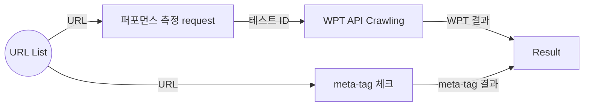

# WPT를 이용한 웹페이지 퍼포먼스 측정
WPT ([https://www.webpagetest.org/](https://www.webpagetest.org/)) 에서 제공하는 퍼포먼스 측정 기능과 API를 이용하여, 
퍼포먼스 측정이 필요한 페이지의 로딩타임과 페이지에 나타나는 content 요소들의 상세 스펙들을 받아오는 작업이다.

~퍼포먼스 측정 및 content/resource/meta-tag 검증 흐름도~



## 퍼포먼스 측정 테스트 ID 수집

하나의 페이지 URL에 대해 퍼포먼스 측정을 하면 해당 측정 결과에 대한 테스트 ID가 생성된다.
생성된 테스트 ID를 resultArray 배열에 push 해주면서 모든 테스트 ID들을 수집한다.

```javascript
const WebPageTest = require('webpagetest');
const wpt = new WebPageTest("www.webpagetest.org",/*로그인 쿠키값*/);

// 퍼포먼스 측정을 진행할 서버 선택 가능
const ServerLocation = {
	'1': 'ec2-ap-southeast-2', //sydney
	'2': 'ec2-ap-northeast-2', //seoul
	'3': 'ec2-ap-northeast-1', //tokyo
	'4': 'ec2-ap-northeast-3', //osaka
	'5': 'ap-south-1' //india
};

// 측정을 위한 세부 설정
const block_options = {
	location: ServerLocation[process.argv[3]],
	connectivity : "3GFast", // 3G 또는 LTE
	firstViewOnly : true,
	emulateMobile : 0, // 모바일 환경 여부
	block : "adobe google" // block 옵션을 사용하지 않을 시엔 삭제
}

// WPT API를 이용하여 측정 테스트 실행 및 결과 테스트 ID 수집
async function runWPT(arg){
	return new Promise((rs, rj)=> {
		wpt.runTest(arg, block_options, async (err, data) => {
			testArray.push(data.data.testId);
			rs();
		})
	})
}

```
